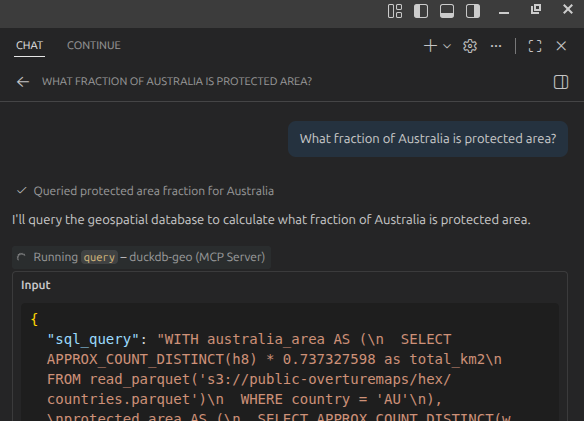

# MCP DuckDB Geospatial Data Server

A [Model Context Protocol (MCP)](https://modelcontextprotocol.io/) server that provides SQL query access to large-scale geospatial datasets stored in S3. Built with DuckDB for high-performance analytics on H3-indexed environmental, biodiversity, and geospatial data.

## Quick Start

Add the hosted MCP endpoint to your LLM client, like so: 


### Using VSCode

create a  `.vscode/mcp.json` like this: ([as in this repo](.vscode/mcp.json))

```json
{
	"servers": {
		"duckdb-geo": {
			"url": "https://duckdb-mcp.nrp-nautilus.io/mcp"
		}
	}
}
```

 
Now simply ask your chat client a question about the datasets and it should answer by querying the database in SQL:

Examples:

- What fraction of Australia is protected area?  





### Using Claude Code (Desktop)

Add to your Claude Desktop configuration file:

**macOS**: `~/Library/Application Support/Claude/claude_desktop_config.json`  
**Windows**: `%APPDATA%\Claude\claude_desktop_config.json`  
**Linux**: `~/.config/Claude/claude_desktop_config.json`

```json
{
  "mcpServers": {
    "duckdb-geo": {
      "url": "https://duckdb-mcp.nrp-nautilus.io/mcp"
    }
  }
}
```

After adding the configuration, restart Claude Desktop.


## Features

- **Zero-Configuration SQL Access**: Query petabytes of geospatial data without database setup
- **H3 Geospatial Indexing**: Efficient spatial operations using Uber's H3 hexagonal grid system
- **Isolated Execution**: Each query runs in a fresh DuckDB instance for security
- **Stateless HTTP Mode**: Fully horizontally scalable for cloud deployment
- **Rich Dataset Catalog**: Access to 10+ curated environmental and biodiversity datasets
- **MCP Resources & Prompts**: Browse datasets and get query guidance through MCP protocol

## Available Datasets

The example configuration provides access to the following datasets via S3:

1. **GLWD** - Global Lakes and Wetlands Database
2. **Vulnerable Carbon** - Conservation International carbon vulnerability data
3. **NCP** - Nature Contributions to People biodiversity scores
4. **Countries & Regions** - Global administrative boundaries (Overture Maps)
5. **WDPA** - World Database on Protected Areas
6. **Ramsar Sites** - Wetlands of International Importance
7. **HydroBASINS** - Global watershed boundaries (levels 3-6)
8. **iNaturalist** - Species occurrence range maps
9. **Corruption Index 2024** - Transparency International data

See [datasets.md](datasets.md) for detailed schema information.  This file is consumed directly by the LLM, additional datasets can be added by describing them here.  


## Local Development


You can also run the server locally


Or install dependencies and run directly:

```bash
pip install -r requirements.txt
python server.py
```


You can now connect to the server over localhost (note http not https here), e.g. in VSCode: 


```json
{
	"servers": {
			"duckdb-geo": {
			"url": "http://localhost:8000/mcp"
		},
	}
}
```

You can adjust the datasets and instructions to the LLM in the corresponding `.md` files (e.g. datasets.md).  You will need to adjust `query-setup.md` to run the server locally, as it uses endpoint and thread count that only work from inside our k8s cluster. 
Running locally means your local CPU+network resources will be used for the computation, which will likely be much slower than the hosted k8s endpoint. 


## Architecture

We have a fully-hosted version 

### Core Components

- **server.py** - Main MCP server with FastMCP framework
- **stac.py** - STAC catalog integration for dynamic dataset discovery
- **datasets.md** - Dataset catalog and schema documentation
- **query-setup.md** - Required DuckDB configuration for all queries
- **query-optimization.md** - Performance optimization guidelines
- **h3-guide.md** - H3 geospatial operations reference

### Key Design Patterns

1. **Prompt Engineering**: Injects strict SQL rules into tool descriptions to guide LLM behavior
2. **Isolation Engine**: Each query gets a fresh DuckDB connection for security
3. **Context Injection**: Documentation is embedded into MCP resources and tool descriptions
4. **Partition Pruning**: Uses H3 resolution columns (`h0`) for efficient S3 reads

## Kubernetes Deployment

Deploy to Kubernetes using the provided manifests:

```bash
kubectl apply -f k8s/deployment.yaml
kubectl apply -f k8s/service.yaml
kubectl apply -f k8s/ingress.yaml
```

The deployment:
- Runs 2 replicas for high availability
- Allocates 16GB memory per pod for large queries
- Uses `uv` for fast dependency installation
- Includes readiness probes for safe rollouts

## MCP Protocol Features

### Tools

- `query(sql_query)` - Execute DuckDB SQL with embedded optimization rules

### Resources

*NOTE*: Some MCP clients, like in VSCode, do not recognize "resources" and "prompts".  Newer clients (Claude code, Continue.dev, Antigravity do) 

- `catalog://list` - List all available datasets
- `catalog://{name}` - Get detailed schema for a specific dataset

### Prompts

- `geospatial-analyst` - Load complete context for geospatial analysis persona

## Query Optimization Tips

1. **Always include h0 in joins** - Enables partition pruning for 5-20x speedup
2. **Use APPROX_COUNT_DISTINCT(h8)** - Fast area calculations with H3 hexagons
3. **Filter small tables first** - Create CTEs to reduce join cardinality
4. **Set THREADS=100** - Parallel S3 reads are I/O bound, not CPU bound
5. **Enable object cache** - Reduces redundant S3 requests

See [query-optimization.md](query-optimization.md) for detailed guidance.

## H3 Spatial Operations

All datasets use Uber's [H3 hexagonal grid system](https://h3geo.org) for spatial indexing:

- Resolution 8 (h8): ~0.737 km² per hex
- Resolution 0-4 (h0-h4): Coarser resolutions for global analysis
- Use `h3_cell_to_parent()` to join datasets at different resolutions
- Use `APPROX_COUNT_DISTINCT(h8) * 0.737327598` to calculate areas in km²

## Testing

```bash
# Run all tests
pytest tests/

# Run specific test file
pytest tests/test_server.py

# Run with coverage
pytest --cov=. tests/
```

## Configuration

### Environment Variables

- `THREADS` - DuckDB thread count (default: 100 for S3 workloads)
- `PORT` - HTTP server port (default: 8000)

### DuckDB Settings

Required settings are documented in [query-setup.md](query-setup.md) and automatically injected into query tool descriptions.

## Security

- **Stateless Design**: No persistent database or user data
- **Read-Only Access**: Server only reads from public S3 buckets
- **Query Isolation**: Each request gets a fresh DuckDB instance
- **DNS Rebinding Protection**: Disabled for MCP HTTP mode


## License

MIT License - See repository for details

## Contributing

Contributions welcome! Key areas:
- Additional dataset integrations
- Query optimization patterns
- STAC catalog enhancements
- Documentation improvements

## References

- [Model Context Protocol](https://modelcontextprotocol.io/)
- [DuckDB Documentation](https://duckdb.org/docs/)
- [H3 Geospatial Indexing](https://h3geo.org)
- [FastMCP Framework](https://github.com/jlowin/fastmcp)
- [STAC Specification](https://stacspec.org/)

## Support

For issues and questions:
- GitHub Issues: [boettiger-lab/mcp-data-server](https://github.com/boettiger-lab/mcp-data-server)
- Dataset questions: See [datasets.md](datasets.md) for data sources


